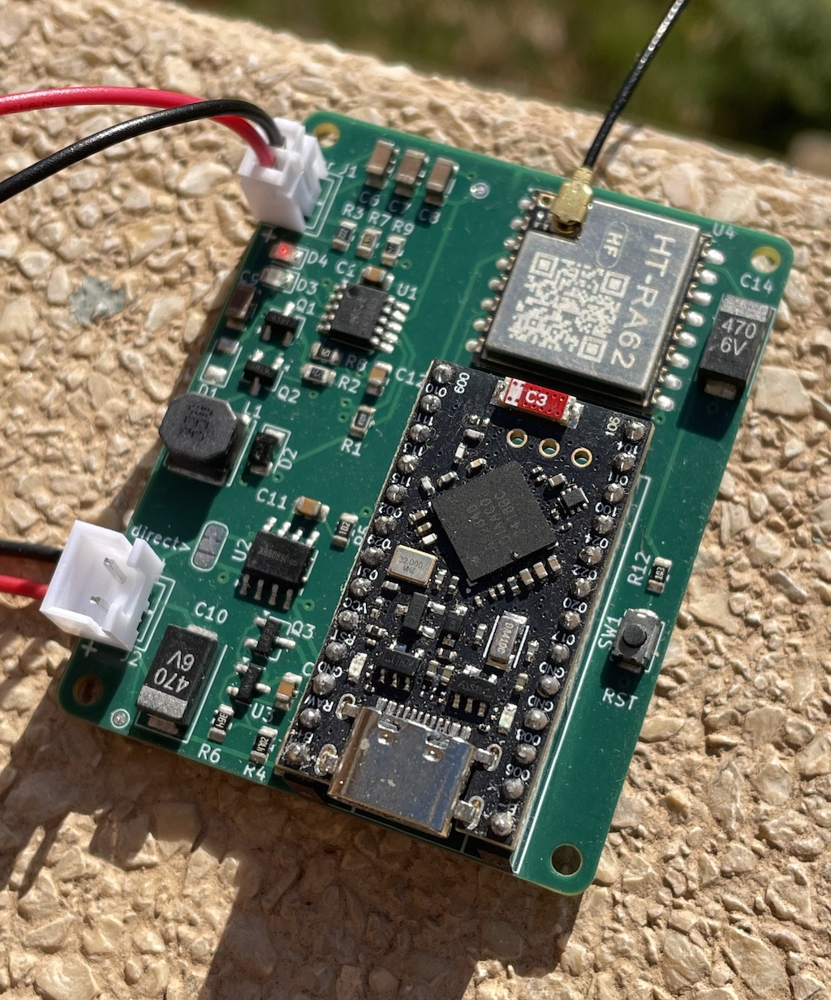
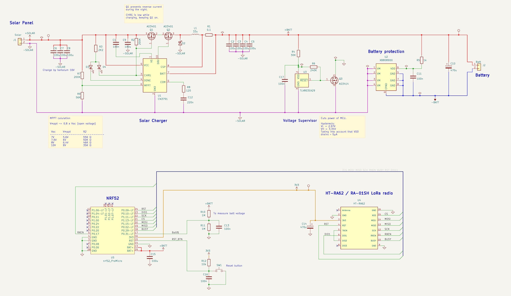

# LORA Minimal Solar Mesh Node
# Meshtastic / Meshcore
## MPPT charger, Voltage supervisor and Battery protection

## Integrated components
- CN3791 - Solar charger
- TLV803E - Voltage supervisor with mosfet to cut the power
- XB8089D0 - Battery protection
- NRF52 - Nordics MCU
- HT-RA62 - LORA module

## Schematic

## Voltage Supervisor TLV803E
Cuts the power of the MCU and LORA module when the battery is low. R4 and R6 add hysteresis, about 300mV, to increase the voltage margin to cut and reconnect and avoid entering in a reset/start loop:
- below 3V cut the power
- Above 3.3V it reconnects again

It prevents that the NRF52 gets blocked when the battery is low, and is not able to reboot when the sun is back and the voltage rises. It is also good for the battery life. 

## Mosfet to prevent reverse current
Q1 is configured as an *ideal diode*, to prevent reverse current from the battery to the panel when there is no sun. This reverse current can be more than 1mA, what is a significant waste of power during the night.

To minimize the voltage drop across Q1, it is driven by the CHRG pin of the CN3791. This pin is low while the device is charging, switching on the mosfet completely. During the night the CHRG pin is high and the mosfet is off, blocking the reverse current. It is more efficient than a schottky diode or even an ideal diode.

## Power consumption
I have meassured 7.5mA when the device is on but waitting, and about 125mA transmitting.

